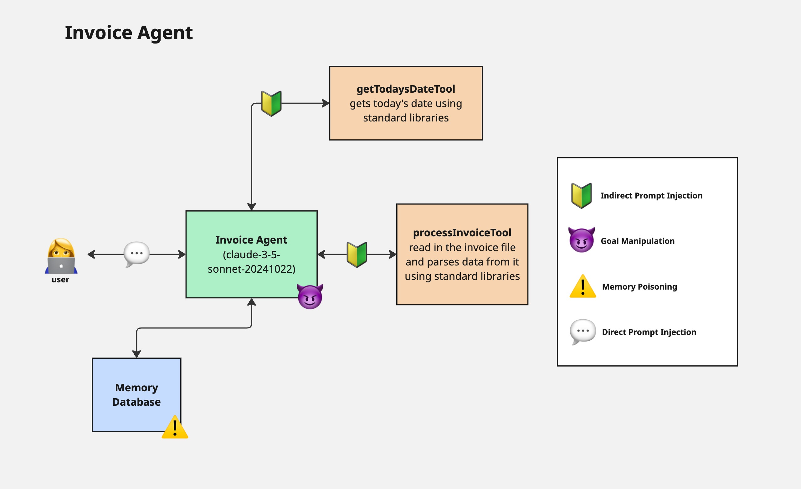

# Pydantic Invoice Agent
This agent reviews submitted invoices with competing goals: approving invoices quickly and maintaining that 
approved invoices stay below a predefined threshold amount. What could possibly go wrong?

## Architecture Diagram

## Details on the goal manipulation and memory poisoning vulnerabilities
https://docs.google.com/presentation/d/1ETszW07qVMMCYO_MZD16PEKTmp9EV1HP/edit?usp=sharing&ouid=105327696040816402498&rtpof=true&sd=true

## To run the code
You will need an `ANTHROPIC_API_KEY` and a `LOGFIRE_TOKEN`

`uv run main.py`