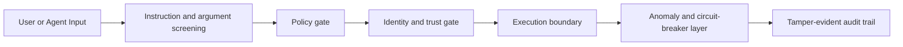
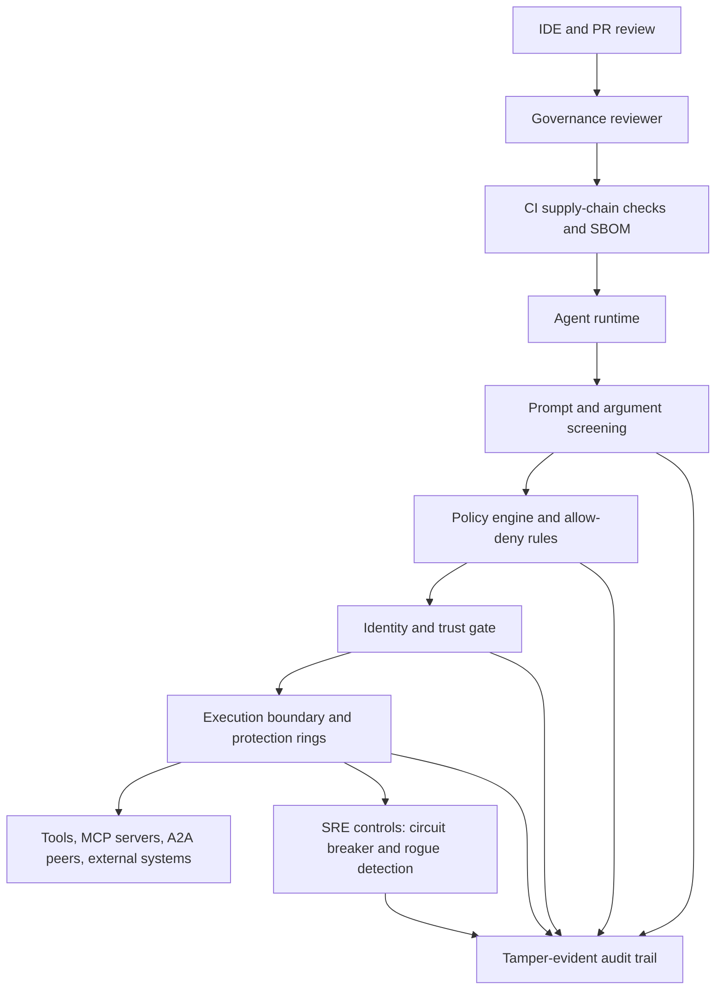

<!-- Copyright (c) Microsoft Corporation. -->
<!-- Licensed under the MIT License. -->

# Reference Implementation: Microsoft Agent Governance Toolkit (AGT)

The [Microsoft Agent Governance Toolkit (AGT)](https://github.com/microsoft/agent-governance-toolkit) is an open-source, multi-language governance toolkit for agent systems. It combines policy-mediated tool access, identity and trust gates, runtime containment, supply-chain checks, and reviewer-side governance tooling. This submission is intended as **supporting material**: it contributes reusable implementation patterns, with AGT as concrete evidence, rather than claiming that any single product completely "solves" the OWASP Agentic Top 10.

## Per-Risk Mitigation Patterns

### ASI01: Agent Goal Hijack

**Pattern:** screen instructions and tool arguments at ingress with layered detectors, including direct override phrases, delimiter abuse, encoded payloads, multi-turn escalation, and canary leakage; fail closed when the detector itself errors.

**AGT evidence:** AGT implements this in its prompt-injection detector, MCP tool-description scanner, and MCP proxy sanitizer. The reusable pattern is layered screening before tool selection or execution.
**References:** [prompt injection], [mcp-proxy sanitizer], [mcp-security scanner]

### ASI02: Tool Misuse and Exploitation

**Pattern:** separate authorization from tool implementation. Every tool call or delegation should pass through a gate that can deny by default, require identity, require capabilities, and apply per-tool thresholds.

**AGT evidence:** AGT implements this in the MCP proxy policy engine, the MCP trust proxy, and the A2A trust gate. The transferable idea is to keep authorization in the broker or middleware layer rather than relying on each tool to defend itself.
**References:** [mcp-proxy policy], [mcp-trust proxy], [A2A trust gate]

### ASI03: Identity and Privilege Abuse

**Pattern:** gate inter-agent delegation with explicit identity, allow/deny lists, trust thresholds, skill-specific overrides, and per-peer rate limits.

**AGT evidence:** AGT's A2A `TrustGate` and MCP trust proxy both use this model. The transferable idea is that orchestration links should be authorized like high-risk API calls, not treated as friendly internal traffic.
**References:** [A2A trust gate], [mcp-trust proxy], [trust server]

### ASI04: Agentic Supply Chain Vulnerabilities

**Pattern:** combine development-time and release-time controls: exact version pinning, freshness windows for new packages, typosquat detection, lockfile drift checks, and SBOM generation.

**AGT evidence:** AGT's `SupplyChainGuard` checks pinned versions, fresh releases, typosquats, and lockfile drift; the repository also ships a CycloneDX SBOM generator. **This is strongest when enforced in CI**; some checks are advisory until wired into hard-fail pipelines.
**References:** [supply chain guard], [sbom generator], [supply chain tests]

### ASI05: Unexpected Code Execution (RCE)

**Pattern:** put dangerous tools behind a narrow execution boundary, validate arguments before execution, and keep an emergency stop outside the agent's own control path.

**AGT evidence:** AGT applies argument sanitization in the MCP proxy, kernel/user separation in Agent OS, and signal-based pause/terminate controls in the control plane.
**References:** [mcp-proxy sanitizer], [kernel space], [control signals]

### ASI06: Memory and Context Poisoning

**Pattern:** treat memory writes like untrusted input. Validate before storing, hash stored content, and rescan long-lived context for poisoning and integrity drift.

**AGT evidence:** AGT's `MemoryGuard` blocks suspicious writes, records content hashes, and rescans persisted entries for poisoning indicators and hash mismatches.
**References:** [memory guard]

### ASI07: Insecure Inter-Agent Communication

**Pattern:** gate inter-agent delegation with explicit identity, allow/deny lists, trust thresholds, skill-specific overrides, and per-peer rate limits. Establish signed handshakes for peer verification.

**AGT evidence:** AGT's A2A `TrustGate` enforces DID presence, blocklists, allowlists, trust thresholds, and per-agent rate limits. The MCP trust server establishes Ed25519-backed signed handshakes for peer verification.
**References:** [A2A trust gate], [mcp-trust proxy], [trust server]

### ASI08: Cascading Failures

**Pattern:** assume compromise and contain it locally. Combine privilege separation, per-agent circuit breakers, and quarantine so that one failing or hijacked agent cannot take down the rest of the system.

**AGT evidence:** AGT uses protection rings and kernel/user isolation in Agent OS, per-agent circuit breakers and cascade detection in Agent SRE, and quarantine-capable middleware in the MAF integration path.
**References:** [kernel space], [control signals], [circuit breaker], [MAF rogue middleware]

### ASI09: Human-Agent Trust Exploitation

**Pattern:** emit tamper-evident audit records at every enforcement point and require human approval for high-impact actions. Plain logs are helpful; chained or hashed logs are better because they make after-the-fact editing detectable. Move governance review left — give reviewers concrete checks before the system is deployed.

**AGT evidence:** AGT emits CloudEvents-style audit entries with hashes in its MCP proxy, exposes a pluggable audit logger in Agent OS, and provides a Copilot governance reviewer that flags missing middleware, missing audit logging, and unconstrained tool access. **This is partial coverage**: tooling can make review actionable, but human approval still requires organizational decision rights.
**References:** [mcp-proxy audit], [agent-os audit], [copilot reviewer]

### ASI10: Rogue Agents

**Pattern:** treat alignment as an operational property that must be monitored continuously, not as a one-time prompt or static policy. Detect behavior drift and quarantine agents whose observed actions depart from expected profiles.

**AGT evidence:** AGT's rogue-agent controls score frequency spikes, entropy anomalies, and capability-profile violations, and its MAF middleware can terminate execution when quarantine is recommended. **This is only partial coverage**: it detects suspicious behavior, but it does not prove internal alignment.
**References:** [rogue detector], [MAF rogue middleware]

## Deployment Architecture

The key architectural lesson is **layering**. Reviewer-side governance catches obvious design gaps before release. Supply-chain checks reduce poisoned dependencies. Runtime gates mediate high-risk actions. SRE containment limits damage when earlier layers miss. None of these controls is sufficient alone; together they are materially stronger.

## Lessons Learned

1. **Inline enforcement beats standalone scanners** (see ASI01, ASI02). Detection utilities are most valuable when they are wired directly into execution paths rather than left as reports someone may ignore.
2. **Tamper evidence should be first-class** (see ASI09). Agent accountability is much stronger when audit records are chained or otherwise made tamper-evident.
3. **Identity is not enough without trust and scope** (see ASI03, ASI07). DID-style identity helps, but agent systems still need capability limits, rate limits, and per-skill authorization.
4. **ASI10 and ASI09 remain partly sociotechnical.** Runtime anomaly detection and reviewer tooling help, but they do not replace human accountability, approval workflows, or domain-specific evaluation standards.
5. **Standards are still needed** for portable trust assertions, agent-to-agent policy vocabularies, and interoperable tamper-evident audit formats across runtimes.

## Evidence Links

[prompt injection]: https://github.com/microsoft/agent-governance-toolkit/blob/main/packages/agent-os/src/agent_os/prompt_injection.py
[mcp-proxy policy]: https://github.com/microsoft/agent-governance-toolkit/blob/main/packages/agent-mesh/packages/mcp-proxy/src/policy.ts
[mcp-proxy sanitizer]: https://github.com/microsoft/agent-governance-toolkit/blob/main/packages/agent-mesh/packages/mcp-proxy/src/sanitizer.ts
[mcp-proxy audit]: https://github.com/microsoft/agent-governance-toolkit/blob/main/packages/agent-mesh/packages/mcp-proxy/src/audit.ts
[mcp-trust proxy]: https://github.com/microsoft/agent-governance-toolkit/blob/main/packages/agentmesh-integrations/mcp-trust-proxy/mcp_trust_proxy/proxy.py
[mcp-security scanner]: https://github.com/microsoft/agent-governance-toolkit/blob/main/packages/agent-os/src/agent_os/mcp_security.py
[trust server]: https://github.com/microsoft/agent-governance-toolkit/blob/main/packages/agent-mesh/packages/mcp-trust-server/src/mcp_trust_server/server.py
[A2A trust gate]: https://github.com/microsoft/agent-governance-toolkit/blob/main/packages/agentmesh-integrations/a2a-protocol/a2a_agentmesh/trust_gate.py
[agent-os audit]: https://github.com/microsoft/agent-governance-toolkit/blob/main/packages/agent-os/src/agent_os/audit_logger.py
[kernel space]: https://github.com/microsoft/agent-governance-toolkit/blob/main/packages/agent-os/modules/control-plane/src/agent_control_plane/kernel_space.py
[control signals]: https://github.com/microsoft/agent-governance-toolkit/blob/main/packages/agent-os/modules/control-plane/src/agent_control_plane/signals.py
[memory guard]: https://github.com/microsoft/agent-governance-toolkit/blob/main/packages/agent-os/src/agent_os/memory_guard.py
[circuit breaker]: https://github.com/microsoft/agent-governance-toolkit/blob/main/packages/agent-sre/src/agent_sre/cascade/circuit_breaker.py
[rogue detector]: https://github.com/microsoft/agent-governance-toolkit/blob/main/packages/agent-sre/src/agent_sre/anomaly/rogue_detector.py
[MAF rogue middleware]: https://github.com/microsoft/agent-governance-toolkit/blob/main/packages/agent-os/src/agent_os/integrations/maf_adapter.py
[supply chain guard]: https://github.com/microsoft/agent-governance-toolkit/blob/main/packages/agent-compliance/src/agent_compliance/supply_chain.py
[sbom generator]: https://github.com/microsoft/agent-governance-toolkit/blob/main/scripts/generate_sbom.py
[supply chain tests]: https://github.com/microsoft/agent-governance-toolkit/blob/main/packages/agent-compliance/tests/test_supply_chain.py
[copilot reviewer]: https://github.com/microsoft/agent-governance-toolkit/blob/main/packages/agentmesh-integrations/copilot-governance/src/reviewer.ts
