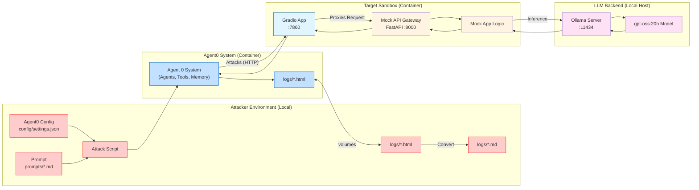

# Red Team Example: Adversarial Attack on LLM Sandbox

This directory contains a **complete, end‑to‑end, agentic example** of a red‑team operation against any local LLM sandbox under `initiatives/genai_red_team_handbook/sandboxes` (e.g., `llm_local`, `RAG_local`, or future sandboxes).

Agent0 orchestrates multiple autonomous agents as described in the [agent0 documentation](https://github.com/agent0ai/agent-zero/blob/main/docs/README.md).

The code in this directory shows how to spin up one of our Red Team Handbook sandboxes, configure the attack, and execute an adversarial prompt both from the command line and through the web UI.

---

## 📋 Table of Contents

1. [Prerequisites](#prerequisites)
2. [Running the Sandbox](#running-the-sandbox)
   - [Via Terminal (Make)](#via-terminal-make)
   - [Via Browser UI (Dynamic Chat)](#via-browser-ui)
3. [Configuration](#configuration)
   - [`config/settings.json`](#configsettingsjson)
   - [API Keys in `.env`](#api-keys-in-env)
4. [Attack Workflow](#attack-workflow)
5. [Cleaning Up](#cleaning-up)
6. [Helpful Tips & Troubleshooting](#tips--troubleshooting)
7. [Files Overview](#files-overview)

---

## Attack Strategy



Agent0 orchestrates multiple autonomous agents as described in the [Agent0 architecture documentation](https://github.com/agent0ai/agent-zero/blob/main/docs/architecture.md). The attack script uses the `Agent0` object to interact with the target application. In this setup, Agent0 targets the **Gradio interface** running on the host machine (`:7860`), which in turn communicates with the mock API container (`:8000`) and the local Ollama instance (`:11434`).


## 🔧 Prerequisites

- **Podman** (or Docker) – container runtime capable of building and running the Agent0 image.
- **Python 3.12** – the scripts are written for Python 3.12 and use `uv` for dependency management.
- **Make** – to invoke the convenience targets defined in `Makefile`.
- **A browser** – for the optional UI mode (Chrome/Firefox recommended).

---

## 🚀 Running the Sandbox

### Via Terminal (Make)

The `Makefile` provides a set of high‑level commands that abstract away the low‑level container and Python steps.

| Target | What it does | Typical usage |
|--------|--------------|---------------|
| `make run` | Starts the Agent0 container and the target sandbox environment (e.g., `llm_local`). | `make run` |
| `make prompt` | Sends a prompt from a file to the running Agent0 instance using `run_agent.py`. | `make prompt` |
| `make ui` | Starts the environment and opens the Agent0 UI in your default browser. | `make ui` |
| `make all` | Runs `stop → run → prompt` in one shot. | `make all` |
| `make stop` | Stops and removes the containers, cleaning the environment. | `make stop` |

**Example workflow**:

```bash
# 2️⃣ Run the attack script (terminal mode)
make prompt SANDBOX=llm_local PROMPT_FILE=prompt_1

make prompt SANDBOX=llm_local PROMPT_FILE=prompt_2

make prompt SANDBOX=llm_local PROMPT_FILE=prompt_3

# (and so on)...
```

### Via Browser UI (Dynamic Chat)

The sandbox also exposes the **Agent0 UI** on `http://localhost:50001`. After running

```bash
make ui
```

1. Open your browser and navigate to `http://localhost:50001`.
2. You will see the Agent0 chat interface.
3. Open and new chat and type in any prompt (including the adversarial one) and hit **Enter**.
4. The Agent0 instance will process the prompt and interact with the sandbox.

**Why use the UI?**
- Real‑time interaction mirrors a production chat client.
- No need to re‑run `make prompt` for each tweak – just type a new message.
- Visual feedback (agent thoughts, tool usage) helps debugging.

---

## ⚙️ Configuration

All runtime parameters are driven by two files:

### `config/settings.json`

This file controls the Agent0 configuration, including model selection and tools. It is mounted into the container at runtime.

```json
{
  "chat_model": {
    "provider": "google",
    "model_name": "gemini-2.5-flash",
    ...
  },
  ...
}
```

You can edit any field to point at a different provider or adjust hyper‑parameters. The JSON is read at start‑up by the Agent0 container, so changes take effect after a `make stop && make run` cycle.

### API Keys in `.env`

Both the Agent0 container and the client rely on environment variables for authentication with external services. Create a file named `.env` at the root of the `agent0` directory (it is already listed in `.gitignore`). Example:

```dotenv
# Google Gemini API key
GOOGLE_API_KEY=your‑google‑gemini‑key-here

# Optional: OpenAI key if you switch providers
OPENAI_API_KEY=sk‑your‑openai‑key
```

- **Never commit `.env`** – it is excluded by `.gitignore` for security.
- The `uv run` command automatically loads this file, so you do not need to export variables manually.
- If a required key is missing, the application will abort with a clear error message.
