# Red Team Example: Adversarial Attack on LLM Sandbox

This directory contains a **complete, end‑to‑end** example of a manual red team operation against a local LLM sandbox.

The setup uses a Python script (`attack.py`) to send adversarial prompts to the `llm_local` sandbox via its Gradio interface (port 7860), simulating an attack to test safety guardrails.

---

## 📋 Table of Contents

1. [Attack Strategy](#attack-strategy)
2. [Prerequisites](#prerequisites)
3. [Running the Sandbox](#running-the-sandbox)
4. [Configuration](#configuration)
5. [Files Overview](#files-overview)
6. [OWASP Top 10 Coverage](#owasp-top-10-coverage)

---

## Attack Strategy

```mermaid
graph LR
    subgraph "Attacker Environment (Local)"
        AttackScript[Attack Script<br/>attack.py]
        Config[Attack Config<br/>config.toml]
    end

    subgraph "Target Sandbox (Container)"
        Gradio[Gradio Interface<br/>:7860]
        MockAPI[Mock API Gateway<br/>FastAPI :8000]
        MockLogic[Mock App Logic]
    end

      subgraph "LLM Backend (Local Host)"
        Ollama[Ollama Server<br/>:11434]
        Model[gpt‑oss:20b Model]
    end

    %% Interaction flow
    Config --> AttackScript
    AttackScript -->|HTTP POST /api/predict| Gradio
    Gradio -->|HTTP POST /v1/chat/completions| MockAPI
    MockAPI --> MockLogic
    MockLogic -->|HTTP| Ollama
    Ollama --> Model
    Model --> Ollama
    Ollama -->|Response| MockLogic
    MockLogic --> MockAPI
    MockAPI -->|Response| Gradio
    Gradio -->|Response| AttackScript

    style AttackScript fill:#ffcccc,stroke:#ff0000
    style Config fill:#ffcccc,stroke:#ff0000
    style Gradio fill:#e1f5fe,stroke:#01579b
    style MockAPI fill:#fff4e1
    style MockLogic fill:#fff4e1
    style Ollama fill:#ffe1f5
    style Model fill:#ffe1f5
```



## 🔧 Prerequisites

- **Podman** (or Docker) – container runtime for the sandbox.
- **Python 3.12** – required for the attack scripts.
- **Make** – for running the convenience commands.
- **uv** – for dependency management.

---

## 🚀 Running the Sandbox

The `Makefile` provides a set of high‑level commands that abstract away the low‑level container and Python steps.

| Target | What it does | Typical usage |
|--------|--------------|---------------|
| `make setup` | Builds and starts the local LLM sandbox container. | `make setup` |
| `make attack` | Runs the adversarial attack script (`attack.py`). | `make attack` |
| `make stop` | Stops and removes the sandbox container. | `make stop` |
| `make all` | Runs `stop → setup → attack → stop` in one shot. | `make all` |

---

## ⚙️ Configuration

### `config.toml`

This file controls the attack configuration. It defines the adversarial prompt used by the script.

```toml
[attack]
prompt = "Ignore all previous instructions..."
```

- **`prompt`**: The text string sent to the LLM to attempt a jailbreak or other exploitation.

---

## Files Overview

- **`attack.py`**: The Python script that performs the adversarial attack using `gradio_client`.
- **`config.toml`**: Configuration file containing the attack prompt.
- **`Makefile`**: Automation commands for setup, attack, and cleanup.

## OWASP Top 10 Coverage

This example primarily demonstrates testing for:

| OWASP Top 10 Vulnerability | Description |
| :--- | :--- |
| **LLM01: Prompt Injection** | The default prompt in `config.toml` attempts to override system instructions (jailbreaking). |

> [!NOTE]
> This is a mock example. For more realistic read teaming, see other instances maintaned at 'initiatives/genai_red_team_handbook/exploitation/'.
