# Red Team Example: Garak Scanner on LLM Sandbox

This directory contains a **complete, end‑to‑end** example of using **[Garak](https://github.com/NVIDIA/garak)**, an LLM vulnerability scanner, against a local LLM sandbox.

The setup uses `garak` to probe the `llm_local` sandbox via its Gradio interface (port 7860), simulating a red team operation to find vulnerabilities like prompt injection, hallucination, and more.

---

## 📋 Table of Contents

1. [Attack Strategy](#attack-strategy)
2. [Prerequisites](#prerequisites)
3. [Running the Sandbox](#running-the-sandbox)
4. [Configuration](#configuration)
5. [Attack Workflow](#attack-workflow)
6. [Cleaning Up](#cleaning-up)
7. [Files Overview](#files-overview)
8. [OWASP Top 10 Coverage](#owasp-top-10-coverage)

---

## Attack Strategy

```mermaid
graph LR
    subgraph "Attacker Environment (Local)"
        AttackScript[attack.py]
        Config[Garak Config<br/>config/garak.yaml]
        Reports[Reports<br/>reports/]
    end

    subgraph "Garak System"
        GarakCore[Garak Core]
        Generator[Custom Generator<br/>integrate.py]
    end

    subgraph "Target Sandbox (Container)"
        Gradio[Gradio Interface<br/>:7860]
        MockAPI[Mock API Gateway<br/>FastAPI :8000]
        MockLogic[Mock App Logic]
    end

      subgraph "LLM Backend (Local Host)"
        Ollama[Ollama Server<br/>:11434]
        Model[gpt‑oss:20b Model]
    end

    %% Interaction flow
    Config --> AttackScript
    AttackScript --> GarakCore
    GarakCore --> Generator
    Generator -->|Gradio Client| Gradio
    Gradio -->|HTTP POST /v1/chat/completions| MockAPI
    MockAPI --> MockLogic
    MockLogic -->|HTTP| Ollama
    Ollama --> Model
    Model --> Ollama
    Ollama -->|Response| MockLogic
    MockLogic --> MockAPI
    MockAPI -->|Response| Gradio
    Gradio -->|Response| Generator
    Generator --> GarakCore
    GarakCore --> Reports

    style AttackScript fill:#ffcccc,stroke:#ff0000
    style Config fill:#ffcccc,stroke:#ff0000
    style Reports fill:#ffcccc,stroke:#ff0000
    style GarakCore fill:#c2e0ff,stroke:#0066cc
    style Generator fill:#c2e0ff,stroke:#0066cc
    style Gradio fill:#e1f5fe,stroke:#01579b
    style MockAPI fill:#fff4e1
    style MockLogic fill:#fff4e1
    style Ollama fill:#ffe1f5
    style Model fill:#ffe1f5
```



## 🔧 Prerequisites

- **Podman** (or Docker) – container runtime for the sandbox.
- **Make** – for running the convenience commands.
- **uv** – for dependency management.

---

## 🚀 Running the Sandbox

The `Makefile` provides a set of high‑level commands that abstract away the low‑level container and Python steps.

| Target | What it does | Typical usage |
|--------|--------------|---------------|
| `make setup` | Builds and starts the local LLM sandbox container. | `make setup` |
| `make attack` | Runs the Garak scan against the sandbox using `attack.py`. | `make attack` |
| `make stop` | Stops and removes the sandbox container. | `make stop` |
| `make all` | Runs `stop → setup → attack → stop` in one shot. | `make all` |

---

## ⚙️ Configuration

### `config/garak.yaml`

This file controls the Garak configuration. It defines which probes to run and how to report results.

```yaml
plugins:
  target_type: "function"
  target_name: "integrate#generate"
  probe_spec: "exploitation"

reporting:
  report_prefix: "reports/GenAI-Red-Team"
  taxonomy: "owasp"
```

- **`probe_spec`**: Determines which probes are active.
- **`target_name`**: Points to the custom generator in `integrate.py`.

---

## Outputs

Results are saved to `reports/` in the following formats: 

* `.jsonl` - Contains all prompts and answers.
* `.html` - Contains a summary of the findings. 

---

## Files Overview

- **`attack.py`**: Entry point for the scan.
- **`integrate.py`**: Custom Garak generator to interface with the sandbox.
- **`config/garak.yaml`**: Garak configuration.
- **`Makefile`**: Automation commands.

## OWASP Top 10 Coverage

The Garak configuration (`config/garak.yaml`) has been tuned to include probes that map to the [OWASP Top 10 for LLM Applications](https://owasp.org/www-project-top-10-for-large-language-model-applications/).


| OWASP Top 10 Vulnerability | Garak Probe(s) | Description |
| :--- | :--- | :--- |
| **LLM01: Prompt Injection** | `ansiescape`, `continuation`, `dan`, `doctor`, `dra`, `encoding`, `fitd`, `goodside`, `latentinjection`, `phrasing`, `promptinject`, `sata` | Tests for direct injection, jailbreaks, and encoding obfuscation. |
| **LLM02: Insecure Output Handling** | `ansiescape`, `av_spam_scanning`, `exploitation`, `fitd`, `packagehallucination`, `web_injection` | Checks for XSS, RCE, and other output handling vulnerabilities. |
| **LLM04: Model Denial of Service** | `divergence` | Tests for resource exhaustion via divergence. |
| **LLM05: Supply Chain Vulnerabilities** | `ansiescape`, `fitd`, `glitch`, `goodside` | Checks for vulnerabilities in third-party components or data. |
| **LLM06: Sensitive Information Disclosure** | `divergence`, `donotanswer`, `exploitation`, `grandma`, `leakreplay`, `web_injection` | Checks for leakage of PII or sensitive data. |
| **LLM09: Overreliance** | `donotanswer`, `goodside`, `misleading`, `packagehallucination`, `snowball` | Tests for hallucination and false information. |
| **LLM10: Model Theft** | `divergence`, `leakreplay`, `topic` | Tests for model extraction or theft. |

> [!NOTE]
> Probes that are not text-based (e.g. `visual_jailbreak` which uses images, or `fileformats` which inspects files) have been excluded from this configuration as the current scope is focused on text-only interactions.
