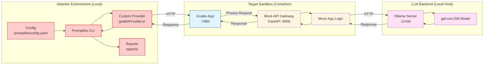

# Red Team Example: Promptfoo Scanner on LLM Sandbox

This directory contains a **complete, end‑to‑end** example of using **[Promptfoo](https://www.promptfoo.dev/)**, a powerful LLM vulnerability scanner and evaluation tool, against a local LLM sandbox.

The setup uses `promptfoo` to probe the `llm_local` sandbox, simulating a red team operation to find vulnerabilities like prompt injection, hallucination, and PII leakage.

---

## 📋 Table of Contents

1. [Attack Strategy](#attack-strategy)
2. [Prerequisites](#prerequisites)
3. [Running the Sandbox](#running-the-sandbox)
4. [Configuration](#configuration)
5. [Attack Workflow](#attack-workflow)
6. [Cleaning Up](#cleaning-up)
7. [Files Overview](#files-overview)
8. [OWASP Top 10 Coverage](#owasp-top-10-coverage)

---

## Attack Strategy



## 🔧 Prerequisites

- **Podman** (or Docker) – container runtime for the sandbox.
- **Node.js** (v18+) – required for `promptfoo`.
- **npx** – usually comes with Node.js, used to run `promptfoo` without global installation.
- **Make** – for running the convenience commands.
- **Ollama** – required to run the local LLM (`gpt-oss:20b`).

> [!NOTE]
> The `make install` command handles the local installation of `promptfoo` into `node_modules`. You do not need to install it globally.

## ⚠️ Important: Ollama Requirement
This setup relies on a local Ollama instance running on your host machine.
1. **Install Ollama**: [Download here](https://ollama.com/).
2. **Start Ollama**: Run `ollama serve` in a separate terminal.
3. **Pull Model**: Run `ollama pull gpt-oss:20b` (or let the sandbox setup handle it).

---

## 🚀 Running the Sandbox

The `Makefile` provides a set of high‑level commands that abstract away the low‑level container and Node.js steps.

| Target | What it does | Typical usage |
|--------|--------------|---------------|
| `make setup` | Installs dependencies and starts the local LLM sandbox container. | `make setup` |
| `make install` | Installs `promptfoo` locally via `npm`. | `make install` |
| `make audit` | Audits and fixes Node.js dependencies. | `make audit` |
| `make attack` | Runs the Promptfoo red team scan against the sandbox. | `make attack` |
| `make view` | Launches the interactive Promptfoo dashboard. | `make view` |
| `make stop` | Stops and removes the sandbox container. | `make stop` |
| `make clean` | Removes generated reports and `node_modules`. | `make clean` |
| `make all` | Runs `stop → setup → attack → view` in one shot. | `make all` |

---

## ⚙️ Configuration

### `promptfooconfig.yaml`

This file controls the Promptfoo configuration. It defines the target (our local sandbox) and the red team plugins to run.

```yaml
targets:
  - id: file://gradioProvider.js
    config:
      apiBaseUrl: http://localhost:7860

redteam:
  plugins:
    - id: "jailbreak"
    - id: "prompt-injection"
    - "harmful:hate"
    - "pii:direct"
    # ... and more
```

- **`targets`**: Points to our local mock API (`http://localhost:8000/v1`).
- **`plugins`**: Determines which vulnerability probes are active.

---

## Outputs

Results are saved to `reports/` in the following formats: 

* `promptfoo-report.html` - A visual report of the findings.
* `promptfoo-report.json` - Raw JSON data of the scan.

---

## Files Overview

- **`promptfooconfig.yaml`**: Promptfoo configuration.
- **`package.json`**: Node.js dependency manifest.
- **`Makefile`**: Automation commands.

## OWASP Top 10 Coverage

The Promptfoo configuration (`promptfooconfig.yaml`) has been tuned to include plugins that map to the [OWASP Top 10 for LLM Applications](https://owasp.org/www-project-top-10-for-large-language-model-applications/).


| OWASP Top 10 Vulnerability | Promptfoo Plugin(s) | Description |
| :--- | :--- | :--- |
| **LLM01: Prompt Injection** | `jailbreak`, `prompt-injection`, `shell-injection`, `sql-injection` | Tests for direct/indirect injection, jailbreaks, and code injection. |
| **LLM02: Insecure Output Handling** | `harmful:insults`, `harmful:violent-crime`, `harmful:sexual-content`, `harmful:misinformation-disinformation`, `harmful:profanity`, `harmful:radicalization` | Checks for harmful content generation and safety violations. |
| **LLM06: Sensitive Information Disclosure** | `pii:direct`, `pii:api-db`, `pii:session`, `pii:social` | Checks for leakage of PII, credentials, or sensitive data. |
| **LLM07: System Prompt Leakage** | `system-prompt-override` | Tests for leakage or override of the system prompt. |
| **LLM09: Overreliance** | `hallucination` | Tests for hallucination and false information. |
| **General Safety** | `competitors`, `politics`, `religion` | Checks for brand safety and bias. |

> [!NOTE]
> Some OWASP categories (like Model Theft or Supply Chain) are harder to test with a black-box scanner and may require manual inspection or different tools.

## ❓ Troubleshooting

### Connection Error (500 Internal Server Error)
If you see `API error: 500 Internal Server Error` with `{"detail":"Connection error."}`, it means the sandbox container cannot reach your local Ollama instance.
- **Fix**: Ensure Ollama is running (`ollama serve`) and accessible.
- **Check**: Run `curl http://localhost:11434/api/tags` to verify Ollama is up.

### Promptfoo Email Verification
If `make view` asks for email verification:
- This is a one-time requirement from `promptfoo` to unlock red teaming features.
- Enter your email, verify, and you won't be asked again.
