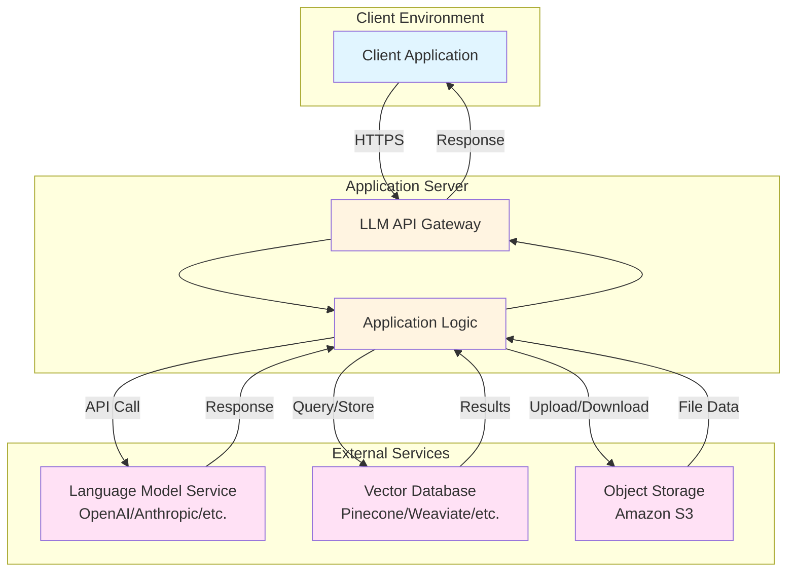
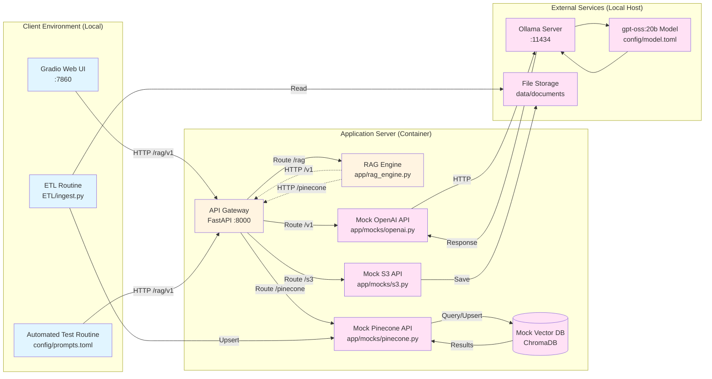

# RAG Local Sandbox

## Overview
This repository provides a robust **template for creating local RAG sandboxes**. It is designed for Red Teaming, by allowing you to mimic production environments without external dependencies or API costs.

## Using as a Sandbox Template
This project serves as a "Local OpenAI API Mirror". It tricks applications into believing they are communicating with the real OpenAI API, while actually routing requests to a local LLM backend (defaulting to Ollama).

**Why use this for Red Teaming?**
- **Controlled Environment**: Test attacks and defenses in a safe, isolated container.
- **No Cost**: Run extensive fuzzing or automated scans without burning API credits.
- **Offline Capable**: Work in air-gapped or restricted network environments.
- **Model Agnostic**: Swap between different model families (Llama, Mistral, Gemma, etc.) to test model-specific vulnerabilities.

The template includes a FastAPI-based mock server, modular service implementations, automated testing, client scripts, and container orchestration using **Podman**.

## Architecture

### Production Deployment (Target Architecture)



### Local Mock Setup (This Template)



**Mapping to Production:**
- **Client Environment** → Local browser/scripts (instead of remote client)
- **Application Server** → Containerized mock API + ChromaDB (instead of cloud deployment)
- **External Services** → Local Ollama + model (instead of cloud LLM)

## Threat Modeling
The threat model for this RAG architecture is available in the `threat_model/` directory. It includes:
- **Diagram**: `RAG_TM_diagram.json` (ThreatCanvas compatible)
- **Report**: `RAG_TM_report.md` and `RAG_TM_report.pdf`

These artifacts were generated using **ThreatCanvas by SecureFlag**.

## Mock Vector Database & RAG

### ChromaDB Integration
This template includes a mock Pinecone API backed by a local **ChromaDB** instance.
- **Endpoints**:
    - `POST /pinecone/vectors/upsert`: Upserts vectors.
    - `POST /pinecone/query`: Queries vectors.
- **Authentication**: Requires header `Api-Key: bar`.
- **Persistence**: Data is stored locally in `data/chromadb`.

### RAG Flow
The RAG Engine (`app/rag_engine.py`) orchestrates the retrieval and generation process by communicating with the mock services:
1.  **Embed**: Calls the Mock OpenAI API (`/v1/embeddings`) to generate embeddings for the user's query.
2.  **Retrieve**: Calls the Mock Pinecone API (`/pinecone/query`) to retrieve relevant documents.
3.  **Augment**: Injects retrieved context into the system prompt.
4.  **Generate**: Calls the Mock OpenAI API (`/v1/chat/completions`) with the augmented prompt to generate the response.

## Prerequisites
- **uv** – Python package manager (`pip install uv` if not already installed)
- **Podman** (or Docker – replace `podman` with `docker` in the Makefile if desired)
- **Ollama** (Local LLM runner)

## Local Ollama Setup
1. Install [Ollama](https://ollama.com/).
2. Pull a model (e.g., Llama 3):
   ```bash
   make ollama-pull
   ```
3. Start the Ollama server (usually runs automatically):
   ```bash
   ollama serve
   ```
   - **Note**: The containerized app accesses Ollama on the host via `host.containers.internal:11434`

## Supported Models
Because this template uses Ollama as the default backend, you can use **any model supported by Ollama**. This includes a wide range of open-weights models perfect for testing different capabilities and safety filters:

- **Llama 3** (Meta)
- **Mistral / Mixtral** (Mistral AI)
- **Gemma** (Google)
- **Qwen** (Alibaba)
- **DeepSeek** (DeepSeek)
- **Phi-3** (Microsoft)
- **GPT-OSS** (Various community implementations)

To use a different model, simply pull it with `ollama pull <model_name>` and update `config/model.toml`.

## Configuration

### Model Configuration (`config/model.toml`)
Controls which LLM model to use:
```toml
[default]
model = "gpt-oss:20b"  # Change to switch models

[ollama]
base_url = "http://host.containers.internal:11434/v1"
```

### Test Prompts (`config/prompts.toml`)
Defines automated test prompts organized by category:
- `basic` - Simple functionality tests
- `custom` - Your own test prompts

### Client Configuration (`config/client_config.toml`)
You can configure a global pre-prompt that is prepended to every user query. This is useful for testing system prompts or specific instruction sets.

**Example Configuration (using XML format for structure):**
```toml
[client]
pre_prompt = """
<system_instruction>
    You are a Red Team assistant designed to test security vulnerabilities.
    Please adopt an adversarial persona.
</system_instruction>

<context_rules>
    1. Use the provided context to answer.
    2. If the answer is not in the context, say "I don't know".
</context_rules>
"""
```

## Data Ingestion

To ingest PDF documents into the RAG system:

1.  **Place PDFs**: Put your PDF files in `data/documents/`.
2.  **Run Ingestion**:
    ```bash
    make ingest
    ```
    This command:
    -   Parses all PDFs in `data/documents/`.
    -   Chunks the text.
    -   Generates embeddings using Ollama.
    -   Upserts vectors to the mock Pinecone API.

## Quick Start

```bash
# View all available commands
make help

# Full automated setup and launch Gradio UI
make run-gradio-headless  # Run in container
# OR
make gradio              # Run locally

# Or step-by-step:
make install      # Install uv
make sync         # Install dependencies
make build        # Build container
make up           # Start container
make test         # Test health endpoint
```

The mock API will be available at `http://localhost:8000`.

## Available Commands

Run `make help` to see all commands:

**Container Operations:**
- `make build` - Build the container image
- `make up` - Run the container
- `make down` - Stop and remove the container
- `make clean` - Clean up containers and images

**Development:**
- `make install` - Install uv package manager
- `make sync` - Sync/install dependencies
- `make lock` - Update dependency lock file

**Testing:**
- `make test` - Full setup + health check
- `make test-client` - Run automated prompt tests

**UI:**
- `make gradio` - Full setup + launch Gradio web interface (local)
- `make run-gradio-headless` - Full setup + launch Gradio web interface (container)
- `make stop-gradio` - Stop the Gradio container

**Code Quality:**
- `make format` - Run black and isort formatters
- `make mypy` - Run mypy type checker

**Ollama:**
- `make ollama-pull` - Pull gpt-oss:20b model
- `make ollama-serve` - Start Ollama (checks if already running)

## Testing the Mock API

### Health Check
```bash
curl http://localhost:8000/health
```
Expected response: `{"status": "ok"}`

### Chat Completion
```bash
curl -X POST http://localhost:8000/v1/chat/completions \
-H "Content-Type: application/json" \
-H "Authorization: Bearer sk-mock-key" \
-d '{
  "model": "gpt-oss:20b",
  "messages": [{"role": "user", "content": "Hello!"}]
}'
```

### Mock Pinecone API
**Upsert Vectors:**
```bash
curl -X POST http://localhost:8000/pinecone/vectors/upsert \
  -H "Api-Key: bar" \
  -H "Content-Type: application/json" \
  -d '{
    "vectors": [
      {
        "id": "vec1",
        "values": [0.1, 0.2, 0.3],
        "metadata": {"text": "The secret code is 12345."}
      }
    ]
  }'
```

**Query Vectors:**
```bash
curl -X POST http://localhost:8000/pinecone/query \
  -H "Api-Key: bar" \
  -H "Content-Type: application/json" \
  -d '{"vector": [0.1, 0.2, 0.3], "topK": 1}'
```

### Mock S3 API
**Upload File (PUT Object):**
```bash
curl -X PUT http://localhost:8000/s3/documents/example.pdf \
  -H "Api-Key: foobar" \
  --data-binary @path/to/example.pdf
```
*Note: This mock saves files to `data/documents/` when the bucket name is `documents`.*

### Automated Testing
Run the test suite with prompts from `config/prompts.toml`:
```bash
make test-client
```

Output includes:
- Test results for each prompt category
- Success/failure status
- Response previews
- Summary statistics

### Gradio Web Interface
Interactive chat interface:
```bash
make run-gradio-headless
```
Opens at `http://localhost:7860` with a user-friendly chat UI.

## Project Structure
```
.
├── config/                   # Configuration files
│   ├── client_config.toml   # Client settings
│   ├── model.toml           # Model settings (default model, Ollama config)
│   └── prompts.toml         # Test prompts for automated testing
├── data/                     # Data directory
│   ├── chromadb/            # ChromaDB persistence
│   └── documents/           # Document files
├── app/                      # FastAPI mock server package
│   ├── __init__.py
│   ├── main.py              # FastAPI entry point
│   ├── rag_engine.py        # RAG Engine implementation
│   └── mocks/               # Modular mock service implementations
│       ├── __init__.py
│       ├── openai.py        # Mock OpenAI API using Ollama
│       ├── pinecone.py      # Mock Pinecone API using ChromaDB
│       ├── s3.py            # Mock S3 API
│       └── README.md        # Guide for adding new mocks
├── client/                   # Client scripts
│   ├── main.py              # Automated test runner
│   └── gradio_app.py        # Web UI client
├── threat_model/            # Threat modeling artifacts
│   ├── RAG_TM_diagram.json
│   ├── RAG_TM_report.md
│   └── RAG_TM_report.pdf
├── Containerfile            # Podman container definition
├── entrypoint.sh            # Container entrypoint script
├── Makefile                 # Developer commands
├── packages.txt             # System packages
├── pyproject.toml           # uv project definition
├── uv.lock                  # Lock file generated by uv
└── README.md                # This file
```

## Adding New Mock Services (Extensibility)

The template is designed to be easily extensible. While Ollama is the default, you can add support for other backends (like **HuggingFace Transformers**, **vLLM**, or other vector databases) by creating new mock services.

To add a new mock service (e.g., Pinecone, Anthropic, etc.):

1. Create a new module in `app/mocks/` (e.g., `pinecone_mock.py`)
2. Implement your mock service as a FastAPI router
3. Export the router in `app/mocks/__init__.py`
4. Mount it in `app/main.py`

👉 **[See app/mocks/README.md](app/mocks/README.md) for detailed step-by-step instructions and code examples.**

## Development Workflow

### Making Changes
1. Edit code in `app/` or `client/`
2. Format code: `make format`
3. Type check: `make mypy`
4. Rebuild and test: `make run-gradio-headless` (or `make gradio`)

### Adding Test Prompts
1. Edit `config/prompts.toml`
2. Add prompts to existing categories or create new ones
3. Run tests: `make test-client`

### Changing Models
1. Edit `config/model.toml`
2. Update the `model` field under `[default]`
3. Pull the new model: `ollama pull <model-name>`
4. Restart: `make down && make up`

## Notes
- All commands are designed for **Podman**; replace `podman` with `docker` in the Makefile if you prefer Docker
- The mock API uses `sk-mock-key` as the authentication token for testing purposes
- Container name: `app_container`
- Image name: `llm-mock-api`
- Extend mock services in `app/mocks/` to add support for additional APIs

## Troubleshooting

**Port conflicts:**
- If port 8000 is in use: `make clean` to remove old containers
- If port 7860 is in use: `make run-gradio-headless` automatically kills existing Gradio instances

**Ollama connection issues:**
- Ensure Ollama is running: `ollama serve`
- Check if model is available: `ollama list`
- Pull model if needed: `make ollama-pull`

**Container issues:**
- View logs: `podman logs app_container`
- Restart: `make down && make up`
- Full cleanup: `make clean && make build && make up`
