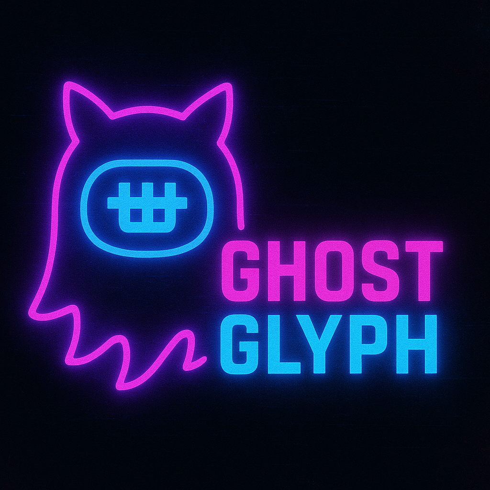

# ghostglyph

A tool to assist with ascii smuggling attacks against generative AI based systems.

# Usage:
1. Download the code
2. Run `uv sync`
3. Run `uv run src/app.py`
4. Open the webpage in a browser

To encode:
1. Enter the text you want to encode and select the type of encoding to use
2. Copy the encoded text and use it in your prompt injection payloads

To decode:
1. Enter the smuggled content and select decode

To detect:
1. Enter the suspect content and select detect

## Screenshots

### Encode

### Decode

### Detect

# Reference Documentation

* [Defending LLM Applications Against Unicode Character Smuggling](https://aws.amazon.com/blogs/security/defending-llm-applications-against-unicode-character-smuggling/) - by Amazon
* [ASCII Smuggler Tool](https://embracethered.com/blog/posts/2024/hiding-and-finding-text-with-unicode-tags/) - by EmbraceTheRed
